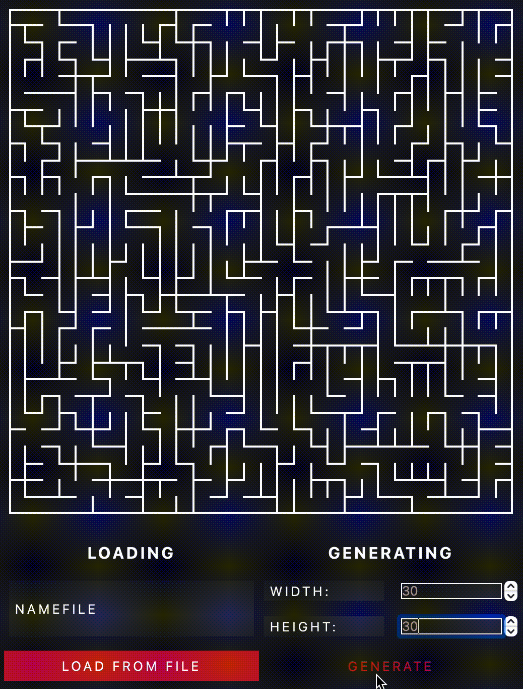

HOW TO BUILD:
=============================
#### Can be opened in Qt creator and build.

# **DOCUMENTATION MAZE**
## **LET'S GO!**
MAZE - is an application that allows you to build mazes and find the shortest path.
#### **EXAMPLE:**

#### **BASIC MAZE FUNCTIONS:**
- Drawing area, where you can choose the start and end point of the path (Wave Algorithm).
- Uploading file from txt-file (show maze).
- Adjust the height and width of the generate maze (Eller Algorithm).
#### **EXAMPLE:**

##### **Finding the shortest path**
#### **HOW TO USE:**
- First, when you run the program you have the choice to load the maze from a file or "GENERATE".
- You can change the height and width of the maze. Setting height and width in windows.
- Select the start point with the left mouse button and the end point with the right mouse button.
#### **RECOMENDATION:**
- Upload a file of a certain format that you can find in the dataset.
- Don't use large txt-files.
### **LET'S TALK ABOUT CAVE**
CAVE - A cave is a certain type of branching location. Such locations can be generated by generation using a cellular automaton.
#### **EXAMPLE:**

#### **BASIC CAVE FUNCTIONS:**
- Uploading file from txt-file (show cave).
- Adjust the height and width of the generate cave (cellular automaton)
- Run сave generation simulation
#### **HOW TO USE:**
- First, when you run the program you have the choice to load the cave from a file or "GENERATE".
- You can change the height and width of the cave. Setting height and width in windows.
- Need sets the limits of "birth" and "death" of the cell, as well as the chance for the initial initialization of the cell
- Need to press the step button or adjust the generation speed
#### **RECOMENDATION:**
- Upload a file of a certain format that you can find in the dataset.
- Don't use large txt-files.

BY STUDENTS OF 21 SCHOOL
